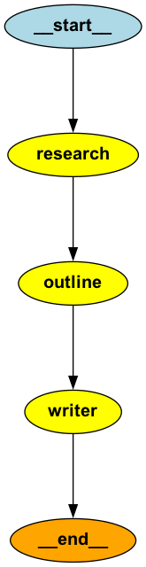

# Agentic AI Training

A practical, hands-on repository of Python code and utilities crafted for exploring agent-based systems in artificial intelligence, with frameworks like **LangChain** and **MCP (Multi-Context Processing)**.

---

## Table of Contents

- [Overview](#overview)  
- [Key Components](#key-components)  
- [Features](#features)  
- [Getting Started](#getting-started)  
- [Developer Setup](#developer-setup)  
- [Usage Examples](#usage-examples)  
- [Visuals / Demo](#visuals--demo)  
- [Learn More](#learn-more)  
- [Contributing](#contributing)  
- [License](#license)

---

## Overview

This repository mirrors the content of the live **Agentic AI training** sessions—offering developers, from beginners to advanced, a sandbox to build, test, and learn through intelligent agent workflows.

---

## Key Components

- **Article Writer Modules**  
  - `article_writer_autogen.py`: Auto-generation pipelines.  
  - `article_writer_langchain_tools.py`: Integrating Langchain for content creation.

- **MCP Servers**  
  - `bmi_mcp_server.py`, `math_mcp_server.py`: Demonstrations of setting up Multi-Context Processing servers for structured data handling.

- **Langgraph Integration**  
  - `langgraph_with_multiple_mcp.py`, `mcp_with_langgraph.py`: Examples of combining Langchain with MCP servers for more advanced agent orchestration.

- **Client Interaction**  
  - `mcp_client.py`: Sample client for real-time interaction with MCP servers.

---

## Features

- Build and experiment with intelligent AI agents in Python.
- Leverage Langchain together with robust MCP server architectures.
- Hands-on scripts for content generation and orchestrated workflows.
- Modular and extensible design tailored for experimentation.

---

## Getting Started

To run locally:

```bash
git clone https://github.com/spallya/agentic-ai-training.git
cd agentic-ai-training
pip install -r requirements.txt
```

Explore the script files to understand how to build and extend agentic AI systems.

---

## Developer Setup

### IDEs
- Recommended: **VS Code** or **PyCharm**
- Both IDEs provide excellent support for Python virtual environments and `.env` configuration.

### Create Virtual Environment
```bash
# Create venv
python -m venv .venv

# Activate venv (Linux / Mac)
source .venv/bin/activate

# Activate venv (Windows PowerShell)
.venv\Scripts\activate

# Install dependencies
pip install -r requirements.txt
```

### API Keys Setup

1. **OpenAI API Key**
   - Sign up / log in at [OpenAI](https://platform.openai.com/).  
   - Generate an API key from the [API Keys dashboard](https://platform.openai.com/account/api-keys).

2. **Groq API Key**
   - Sign up / log in at [Groq](https://console.groq.com/).  
   - Generate an API key from the dashboard.

### Configure `.env` File

Create a `.env` file in the project root with the following content:

```ini
OPENAI_API_KEY=your_openai_api_key_here
GROQ_API_KEY=your_groq_api_key_here
```

> The code automatically loads these values when running scripts.

---

## Usage Examples

```bash
# Generate an article using the auto-gen agent
python article_writer_autogen.py

# Launch an MCP server (e.g., math context processing)
python math_mcp_server.py

# Connect to an MCP server with the client
python mcp_client.py
```

---

## 📸 Visuals / Demo

<table>
  <tr>
    <td align="center" valign="top">
      <b>Article Writer Graph</b><br>
      
    </td>
    <td align="center" valign="top">
      <b>Graph with Tools and Conditional Edge</b><br>
      
    </td>
  </tr>
</table>
---

## Learn More

- [Langchain Documentation](https://langchain.com)  
- [MCP Framework Overview](https://modelcontextprotocol.io)  

---

## Contributing

Contributions are highly valued! If you'd like to suggest enhancements, fix bugs, or propose new features, please fork the repo and submit a pull request.

---

## License

Licensed under the **MIT License**—see the [LICENSE](LICENSE) file for full details.
